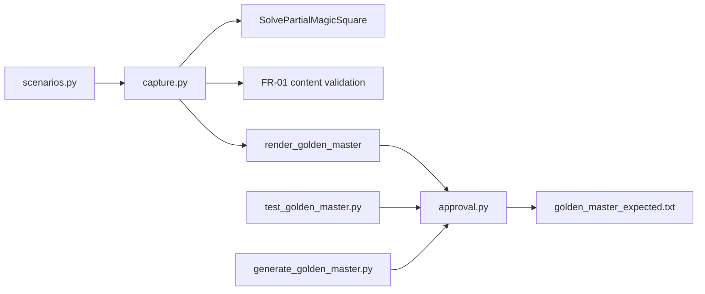

# Golden Master (Approval) Regression — Design

| 항목 | 내용 |
|------|------|
| **문서 ID** | `golden_master_approval_design` |
| **기준 SSOT** | [`Report/02`](../Report/02_MagicSquare_DualTrack_CleanArchitecture_TDD_Design.md), [`docs/PRD_MagicSquare.md`](PRD_MagicSquare.md) |
| **산출물** | `tests/golden_master_expected.txt`, `scripts/generate_golden_master.py`, `tests/golden_master/` |

---

## 1. 목적

Magic Square Solver의 **E2E 출력 회귀**를 Golden Master(Approval) 패턴으로 보호한다.

- 정상 해(success)와 FR-01 오류·UNSOLVABLE 경로의 **직렬화 결과**를 하나의 기준 파일에 고정
- 구현 변경 시 **의도적 계약 변경**만 `--approve` / `GOLDEN_MASTER_APPROVE=1`로 갱신
- 비의도적 drift는 **unified diff**와 함께 pytest FAIL

---

## 2. 아키텍처



| 모듈 | 역할 |
|------|------|
| `tests/golden_master/scenarios.py` | 5개 시나리오 키·격자 정의 |
| `tests/golden_master/capture.py` | DTO 직렬화 → 섹션 텍스트 |
| `tests/golden_master/approval.py` | 기준 없으면 생성 / 있으면 diff |
| `tests/golden_master/test_golden_master_magic_square.py` | GM-TC-01~05 + full-file pytest |
| `scripts/generate_golden_master.py` | CI·로컬 기준 재생성 CLI |

---

## 3. 입력 시나리오

| 섹션 키 | 의미 | 격자 출처 |
|---------|------|-----------|
| `normal_success` | small-first 성공 | 사용자 지정 4×4 (blanks (3,3),(4,4)) |
| `reverse_success` | reverse 성공 | F2 / `GRID_G1` (Report/02) |
| `invalid_blank_count` | 빈칸 ≠ 2 | `GRID_THREE_BLANKS` (U-IN-05) |
| `duplicate_number` | 비0 중복 | `GRID_TD_05` (U-IN-08) |
| `no_valid_magic_square` | 양쪽 조합 실패 | F3 stand-in (G3 SSOT 확정 전) |

---

## 4. 출력 캡처 전략

**Primary:** `SuccessResponse` / 시맨틱 `Error:` 토큰 직렬화 (stdout 아님).

성공:

```text
[normal_success]
Input:
16 2 3 13
...
Output:
[3, 3, 6, 4, 4, 1]
```

오류 (Boundary 코드 → Golden 시맨틱):

| Boundary / Domain | Golden `Error:` 토큰 |
|-------------------|----------------------|
| `E002` (blank count) | `INVALID_BLANK_COUNT` |
| `E005` (duplicate) | `DUPLICATE_NUMBER` |
| `UnsolvableDomainError` | `NO_VALID_MAGIC_SQUARE` |

> **Note:** `UIBoundary`의 FR-01 content validation(U-IN-04~08) GREEN 전까지, Golden harness가 `capture.py` 내부 `_validate_content()`로 동일 규칙을 적용한다. InputValidator GREEN 후에는 해당 호출로 교체한다.

---

## 5. Approve 패턴

| 조건 | 동작 |
|------|------|
| `golden_master_expected.txt` **없음** | 현재 캡처로 **자동 생성**, 테스트 PASS |
| 기준 **있음**, 출력 **일치** | PASS |
| 기준 **있음**, 출력 **불일치** | unified diff 출력 후 **FAIL** |
| `GOLDEN_MASTER_APPROVE=1` 또는 `--approve` | 기준 **덮어쓰기**, PASS |

### 로컬 명령

```powershell
# 회귀 (마커 필터)
python -m pytest -m golden_master -v

# 기준 갱신 (의도적 계약 변경 후)
$env:GOLDEN_MASTER_APPROVE = "1"
python -m pytest -m golden_master -v

# 또는 생성 스크립트
python scripts/generate_golden_master.py --approve
git add tests/golden_master_expected.txt
```

---

## 6. 기준 파일 형식

- UTF-8, LF 줄바꿈
- 섹션 구분: `________________________________________` (빈 줄 포함)
- 섹션 헤더: `[scenario_key]`
- 입력: `Input:` + 공백 구분 4행
- 성공: `Output:` + Python `list[int]` 리터럴
- 실패: `Error:` + 단일 시맨틱 토큰

---

## 7. ECB·TDD 정합

- Golden harness는 **`tests/` 전용** — Entity/Control/Boundary `src/` 미수정
- 성공 경로는 **실제** `SolvePartialMagicSquare` 호출 (Mock 금지)
- Boundary 트랙 U-IN GREEN 후 `_validate_content` → `InputValidator.validate()` 위임 권장
- F3(G3) 확정 시 `GRID_NO_VALID_SOLUTION`만 `scenarios.py` 갱신 + `--approve`

---

## 8. CI 권장

```yaml
- run: python -m pytest tests/test_golden_master.py -v
```

기준 갱신 PR에는 diff 검토 + Report/02·PRD 계약 변경 근거 필수.
